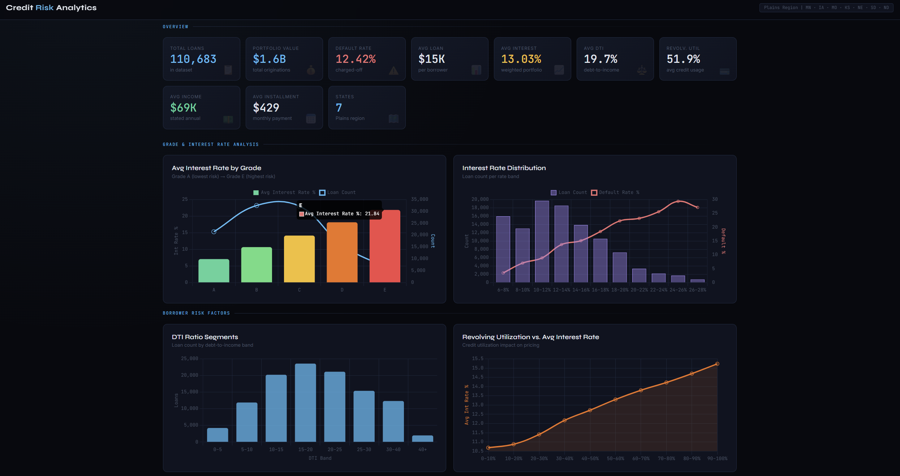
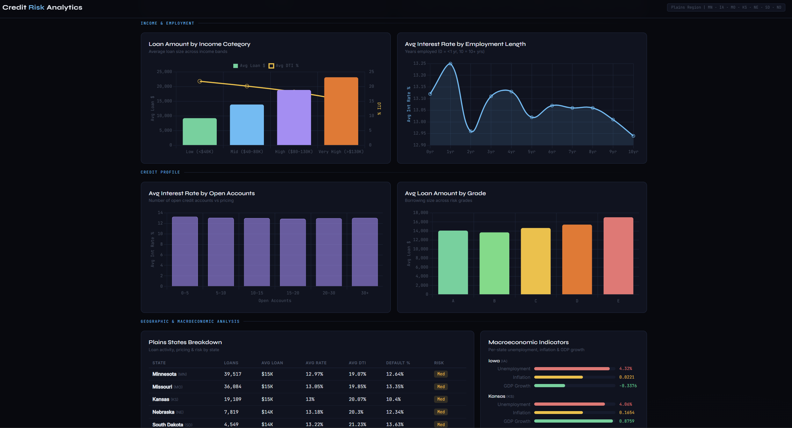

# Credit Risk Analytics

An interactive web dashboard for exploring credit risk patterns across the **Plains region** (MN, IA, MO, KS, NE, SD, ND) using Lending Club loan data (2007–2018) enriched with macroeconomic indicators (FRED, BLS, BEA).

---

## Dataset

> **The raw data file is NOT included in this repository** due to its size (original dataset with 2,260,668 rows and 145 columns).

### Required columns after preprocessing

The app expects a cleaned CSV at `data/cleaned_loan_data (2).csv` with at least these columns:

| Column | Description |
|---|---|
| `loan_amnt` | Loan amount ($) |
| `int_rate` | Interest rate (%) |
| `dti` | Debt-to-income ratio |
| `revol_util` | Revolving line utilization (%) |
| `annual_inc` | Annual income ($) |
| `installment` | Monthly installment ($) |
| `emp_length_num` | Employment length (numeric, years) |
| `grade_num` | Loan grade (1=A, 2=B, 3=C, 4=D, 5=E) |
| `income_cat` | Income category (0=Low, 1=Mid, 2=High, 3=Very High) |
| `addr_state` | Borrower state (MN, IA, MO, KS, NE, SD, ND) |
| `default` | Default flag (0 = no default, 1 = default) |
| `open_acc` | Number of open credit accounts |
| `issue_d` | Loan issue date (parsed as datetime) |
| `unemployment_rate` | State-level unemployment rate (FRED) |
| `inflation` | Inflation rate (BLS) |
| `gdp_growth` | GDP growth rate (BEA) |

### Preprocessing steps (from `Credit_Risk_.ipynb`)

Run the Jupyter notebook to reproduce the cleaned dataset from raw Lending Club data:

```bash
jupyter notebook Credit_Risk_.ipynb
```

The notebook handles: filtering to Plains states → feature engineering → macroeconomic data merge → encoding → export to `data/cleaned_loan_data (2).csv`.

---

## Steps to Run

**1. Clone the repository**

```bash
git clone https://github.com/vuchau0802/Credit-Risk-Analytics.git
cd Credit-Risk-Analytics
```

**2. Create and activate a virtual environment**

```bash
# Windows
python -m venv venv
venv\Scripts\activate

# macOS / Linux
python -m venv venv
source venv/bin/activate
```

**3. Install dependencies**

```bash
pip install -r requirements.txt
```

**4. Run the app**

```bash
python app.py
```

---

## Demo

> Plains region states covered: Minnesota, Iowa, Missouri, Kansas, Nebraska, South Dakota, North Dakota.




